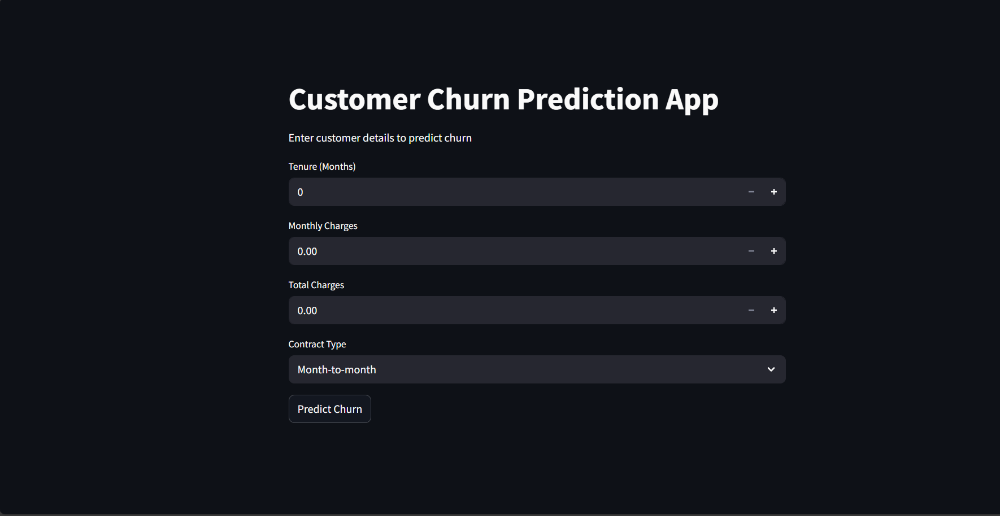
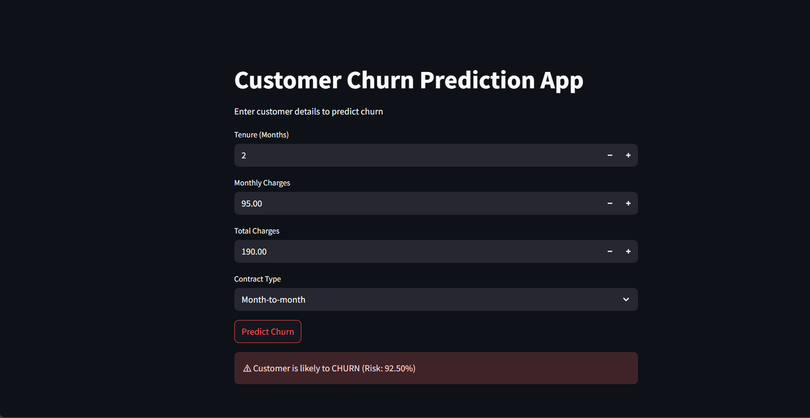

Project Overview:
This project is a machine learning-powered web application that predicts whether a telecom customer is likely to churn based on key customer attributes. The application uses a trained Random Forest model and is deployed locally using Streamlit.

Tech Stack:
Python
Streamlit
Pandas
NumPy
Scikit-learn
Joblib

Features:
Interactive web interface
Real-time churn prediction
Probability-based risk output
Fast and lightweight deployment

App Preview:

How To Run Locally:
pip install -r requirements.txt
streamlit run app.py

Author:
pip install -r requirements.txt
streamlit run app.py
